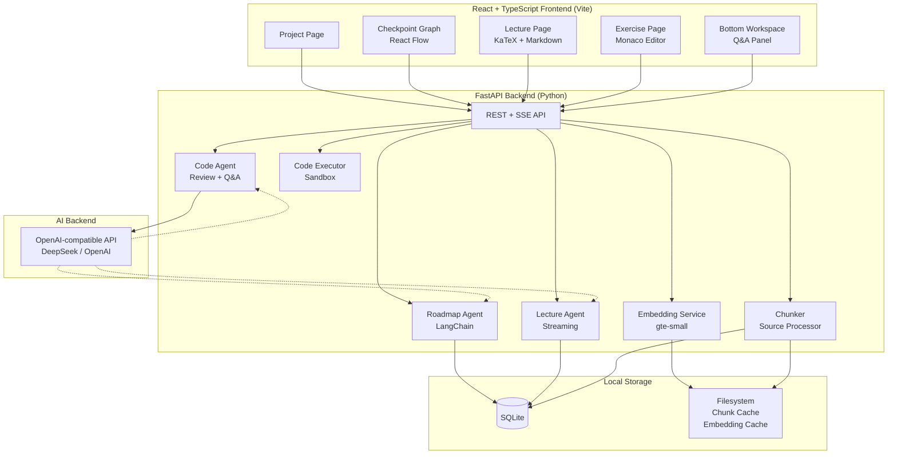
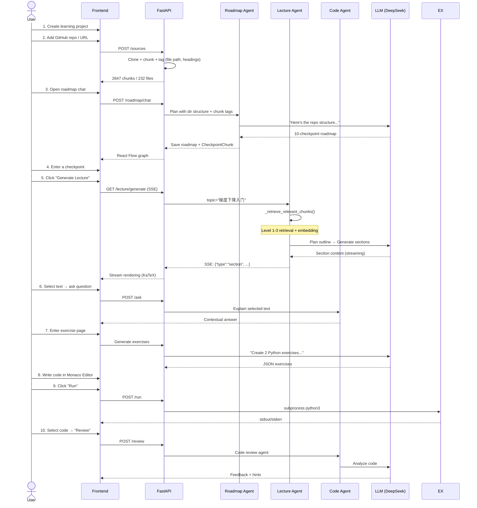
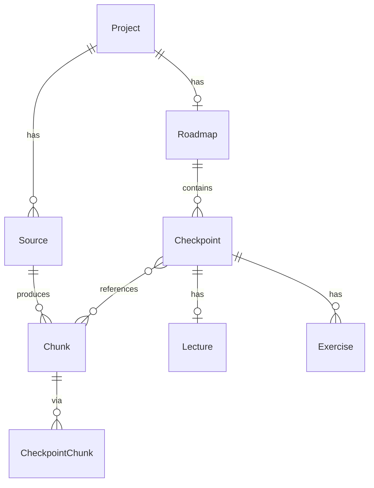

# ✦ LearnFlow

**AI-driven adaptive learning platform.** Define a learning task (e.g., deep learning), provide reference sources (GitHub repos, URLs), and let AI plan your roadmap, generate lectures, create coding exercises, and review your code.

Built as a learning tool — not a chatbot wrapper. Every feature is designed around the cognitive process of *learning*, not just information retrieval.

---

## ✨ Features

| Feature | Description |
|---------|-------------|
| **📚 Source Management** | Add GitHub repos or URLs as learning materials. Auto-chunk with file-path tagging |
| **🗺️ Adaptive Roadmap** | AI agent converses with you to plan a checkpoint-based learning path. Persistent chat history |
| **📖 AI Lecture Generation** | SSE-streamed, structured lectures with KaTeX formulas, ASCII diagrams, and self-check questions |
| **💬 Inline Q&A** | Select any text in a lecture → bottom workspace explains it. No context switching |
| **💻 IDE Training** | Monaco Editor built in. Run code, get AI review, ask questions about selected code |
| **🧠 RAG Retrieval** | 4-level fallback: file path → headings → keyword density → vector similarity (gte-small) |
| **🧩 Graph Checkpoints** | React Flow renders the learning path as an interactive DAG. Click to enter each checkpoint |

---

## 🚀 Quick Start

```bash
# Prerequisites: Python 3.11+, Node.js 18+, Git

# Clone
git clone https://github.com/runzhong123-max/LearnFlow.git
cd LearnFlow

# Backend setup
cd backend
python3 -m venv venv
source venv/bin/activate
pip install -r requirements.txt
cp .env.example .env
# Edit .env: set LLM_API_KEY (supports OpenAI / DeepSeek / any OpenAI-compatible API)

# Frontend setup
cd ../frontend
npm install

# Launch
cd ..
bash start.sh
# → Frontend: http://localhost:5173
# → Backend:  http://localhost:8000
```

### macOS App

Double-click `LearnFlow.app` in `/Applications` after first run, or install as a **PWA** via Safari/Chrome for a native-feeling experience.

---

## 🏗️ Architecture

### System Overview



### Agent Orchestration



---

## 🧠 RAG Retrieval Strategy

LearnFlow implements a **4-level fallback retrieval** to find the most relevant chunks for any query:

```
User Query (e.g., "梯度下降入门")
       │
       ▼
┌─ Query Expansion ──────────────────────┐
│  "梯度下降" → ["gd", "gradient descent",│
│  "参数更新", "最速下降法", ...]          │
│  + dynamic_top_k (simple→8, complex→25)│
└────────────────┬───────────────────────┘
                 ▼
┌─ Multi-path Recall (L1) ───────────────┐
│  ● File path keyword match  (weight 5) │
│  ● Heading / topic_hints   (weight 3)  │
│  ● Full-text density       (weight 1-5)│
│  ● Vector similarity       (weight 10) │
└────────────────┬───────────────────────┘
                 ▼
┌─ Weighted Fusion (L2) ─────────────────┐
│  Score = Σ(route_score × weight)       │
│  → Top-k by complexity                 │
└────────────────┬───────────────────────┘
                 ▼
            top-k chunks → LLM
```

### Query Expansion (Phase 3.5)

Built-in domain-specific thesaurus (~20 groups) for keyword expansion:
```
梯度下降 → gradient descent, GD, parameter update, steepest descent
反向传播 → backpropagation, backprop, BP, chain rule
注意力   → attention, self-attention, transformer, scaled dot-product
...
```
Expanded keywords feed into all retrieval levels. No external API required.

### Embedding Backend (Phase 4)

| Backend | Vector Dim | Quality | Requirements |
|---------|-----------|---------|-------------|
| `local` (default) | 384 (gte-small) | Good | `pip install sentence-transformers` |
| `api` | configurable (e.g. 1024) | Better | API key with embedding support |

Configurable via `.env`:
```env
EMBEDDING_BACKEND=local   # local | api
EMBEDDING_MODEL=text-embedding-ada-002   # only for api backend
```
The local backend runs entirely on-device. Switch to `api` for higher quality embeddings when available.

---

## 📦 Repository Processing

```
GitHub / URL
    │
    ▼
Clone (git clone --depth 1)  ──fail──►  GitHub API tarball  ──fail──►  README only
    │
    ▼
File walk + filter (readable extensions, skip build dirs)
    │
    ├── README → Parse Table of Contents (Level 1 structure)
    ├── Directory tree → Heuristic grouping (Level 2)
    └── Per-file content:
         │
         ▼
    Markdown split by headings → chunks with:
    • file path tag       ("chapter_linear-regression/linear-regression.md")
    • heading chain       (["线性回归", "损失函数"])
    • topic hints         (["regression", "linear model", "least squares"])
    
    ──► Chunks → Embedding (gte-small, 384d) → Cache
```

---

## 🛠️ Tech Stack

| Layer | Technology |
|-------|-----------|
| **Backend** | FastAPI (Python 3.11+) + SQLAlchemy + SQLite |
| **Frontend** | React 18 + TypeScript + Vite + TailwindCSS |
| **Code Editor** | Monaco Editor |
| **Graph** | React Flow |
| **Formulas** | KaTeX via react-markdown |
| **AI** | LangChain + OpenAI-compatible API (DeepSeek) |
| **Embedding** | sentence-transformers (gte-small, local) |
| **Chunking** | LangChain RecursiveCharacterTextSplitter |

### Why Separated Architecture?

FastAPI for AI orchestration (Python ecosystem is irreplaceable for ML/AI tooling). React for complex UI (Monaco Editor, KaTeX, React Flow are all React-native). Communication via REST + SSE.

---

## 📁 Project Structure

```
LearnFlow/
├── backend/
│   ├── app/
│   │   ├── api/           # Route handlers (4 phases)
│   │   ├── core/          # Settings, config
│   │   ├── db/            # SQLAlchemy async setup
│   │   ├── models/        # 8 data models
│   │   └── services/      # Agents, chunker, executor, embedding
│   └── requirements.txt
├── frontend/
│   ├── src/
│   │   ├── components/    # Layout, lecture, checkpoint, workspace
│   │   ├── pages/         # Home, Project, Checkpoint, Exercise
│   │   └── services/      # API client + SSE client
│   └── package.json
├── docs/
│   ├── PROJECT_PLAN.md    # Full development plan
│   └── RAG_PLAN.md        # RAG design document
├── start.sh               # One-click launcher
├── learnflow               # CLI command
└── LearnFlow.command       # macOS double-click launcher
```

---

## 📊 Data Model



---

## 📜 License

MIT

---

## 🙏 Acknowledgments

Built with [OpenClaw](https://openclaw.ai) as the agent framework. Inspired by [d2l.ai](https://d2l.ai) and every learner who's ever felt lost in a sea of tabs.
