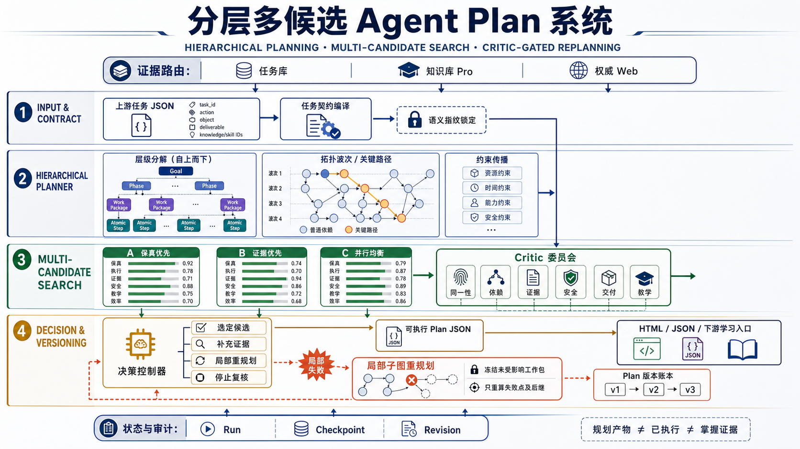

# 学习型工作任务 Agent Plan 接入

本模块在远端基础 TaskPlan 之上增加了可审计的深度规划分析层。它真实生成分层任务树、依赖调度、三类候选 Plan、六维 Critic 评审、决策门禁、风险清单和版本化局部重规划；但仍不把规划产物描述为已经执行，也不保存隐藏思维链。



## 运行链

```text
主 Agent 对话
  -> POST /api/learning-task-conversion/plans
  -> 远端 POST /api/v1/learning-work-task-agent/runs
  -> 锁定 task_contract + semantic_fingerprint
  -> 本地规划分析器生成四层任务树与依赖 DAG
  -> 保真优先 / 证据优先 / 并行均衡三类候选
  -> 六维 Critic 门禁与加权决策
  -> 中央工作区 /learning-task-plans/:runId
  -> 用户检查层级、关键路径、候选、风险和版本账本
  -> POST /api/learning-task-conversion/plans/:runId/confirm
  -> 远端 POST /api/v1/learning-work-task-agent/runs/:runId/plan
  -> PLAN_READY
  -> 观察到局部失败时 POST /plans/:runId/replan
  -> 冻结未受影响工作包，只重算目标工作包及其后继子图
```

远端返回的 `learning-work-task-plan-v1` 是显式计划产物，不包含或接收隐藏思维链字段。LearnFlow 会再次校验：

- Run ID 与任务语义指纹一致；
- 工作包 ID 唯一，依赖存在且无环；
- 角色、工具和产物类型属于版本化白名单；
- Plan 版本确认时严格递增；
- 当前学习者只能恢复和确认自己会话中创建的 Run。

规划分析层额外输出 `learning-work-task-planning-analysis-v1`：

- 四层层级：Goal → Phase → Work Package → Atomic Step；
- 拓扑波次、关键路径与依赖边；
- `fidelity_first`、`evidence_first`、`balanced_parallel` 三个候选；
- 任务同一性、依赖、证据、安全、交付、教学适配六维 Critic；
- 显式权重评分、硬门禁、选定候选和触发规则；
- 风险与缓解控制、修订预算、不可变版本账本；
- 局部失败时计算后继闭包，冻结无关工作包并生成新分析版本。

## API

| 方法 | 路径 | 说明 |
|---|---|---|
| `POST` | `/api/learning-task-conversion/plans` | 在当前 Tutor session 中创建真实远端 Run 和初始 Plan |
| `GET` | `/api/learning-task-conversion/plans/{run_id}` | 按 learner ownership 恢复远端状态；远端临时不可用时只读回退到已校验快照 |
| `POST` | `/api/learning-task-conversion/plans/{run_id}/confirm` | 幂等确认当前 Plan，并由远端校验后推进到 `PLAN_READY` |
| `POST` | `/api/learning-task-conversion/plans/{run_id}/replan` | 基于失败工作包和观察结果生成局部子图修订版本，不伪装为已执行 |

创建、确认和局部重规划分别记录 `learning_work_task_plan_created`、`learning_work_task_plan_confirmed` 和 `learning_work_task_plan_replanned`。三者均为零 kernel target 的计划产物/操作事件，不代表学习、练习或掌握。

## 当前边界

- 已实现：任务契约锁定、初始 TaskPlan、四层分解、依赖调度、三候选搜索、六维 Critic、决策门禁、风险清单、局部子图重规划、版本确认、远端恢复、learner 隔离和审计事件。
- 尚未宣称实现：真实工具执行、证据内容抓取、Worker 产物生成、环境 Observation 自动采集和最终交付发布。页面中的所有状态明确标记为 `not_executed`。
- 旧的完整任务生成接口仍保留在后端用于兼容；主对话的任务工具现在先进入 Plan 页面，不再把一次最终文本调用伪装成可观察 Planning。

## Contract impact

这是向后兼容的新增能力：复用 `plan_learning_work_task` 和中央工作台，增加一个零核局部重规划事件；没有修改三类主 Agent、五核键、EvidenceEvent schema、确定性归约或现有任务 Bundle 契约。
